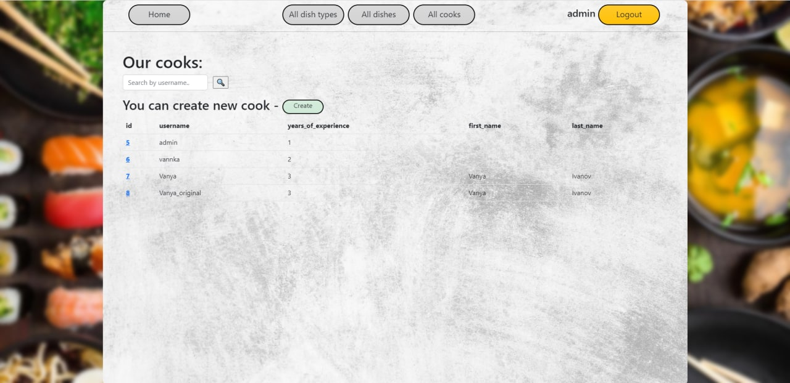
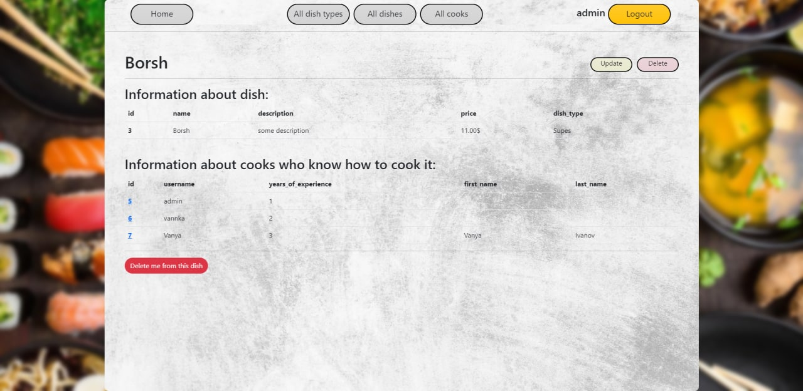
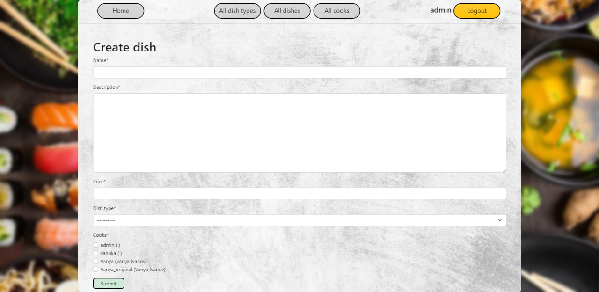

# restaurant-kitchen-service
Django project for managing kitchen

# Check it out!
[Link on render](PASTE_LINK)

# Installation

Python3 must be already installed

```shell
git clone https://github.com/Kitazuka/restaurant-kitchen-service
cd restaurant-kitchen-service
python3 -m venv venv
source venv/bin/activate
pip install -r requirements.txt
python manage.py runserver
```

# Demo








